Glider 6 case for FDM printing
version: v1.0
2026/02/18

# About folders

## Glider_6_case_without_TP_FL

This version is designed for Glider with recycled ED060KD1 panel without touch or front light module. (If you ordered the Glider kit from Crowd Supply, this is the version you need)

## Glider_6_case_with_TP_FL

This version is designed for Glider 6 driver board with your own ED060KD1 or other 6" 34P panels with laminated touch and front light module.

# Assembly

Step1: Prepare Glider 6 module, 3D printed cases, buttons and 6x M2.5*6 screws.

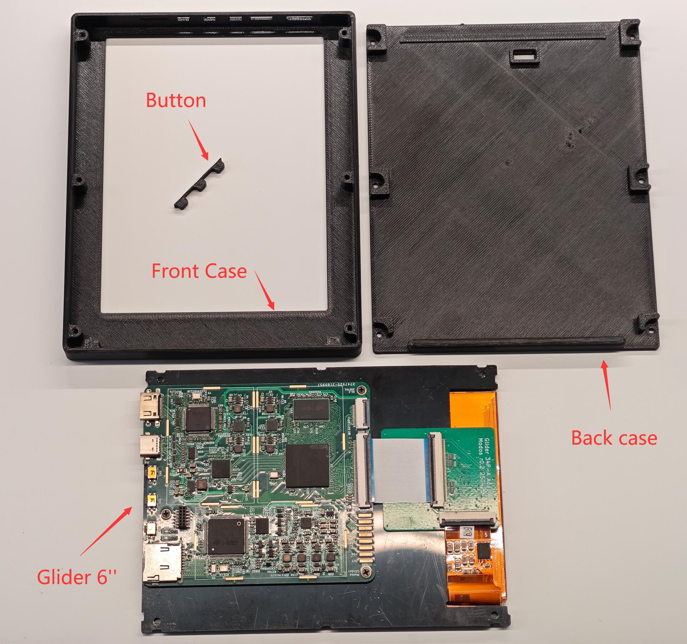

About screws:  M2.5*6 flat head screws, seen below:

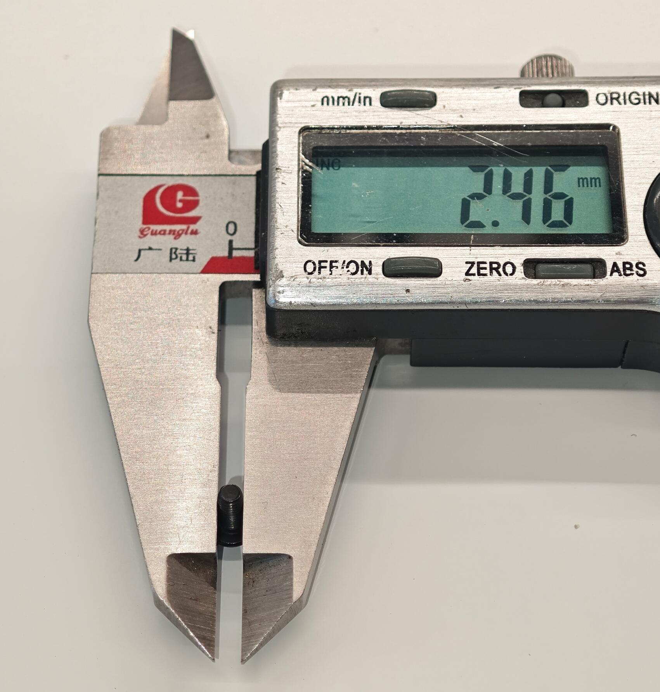 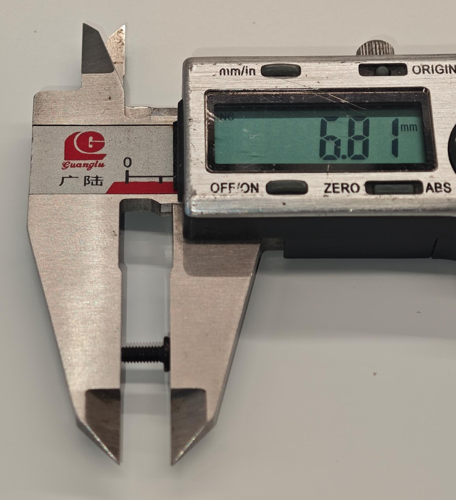 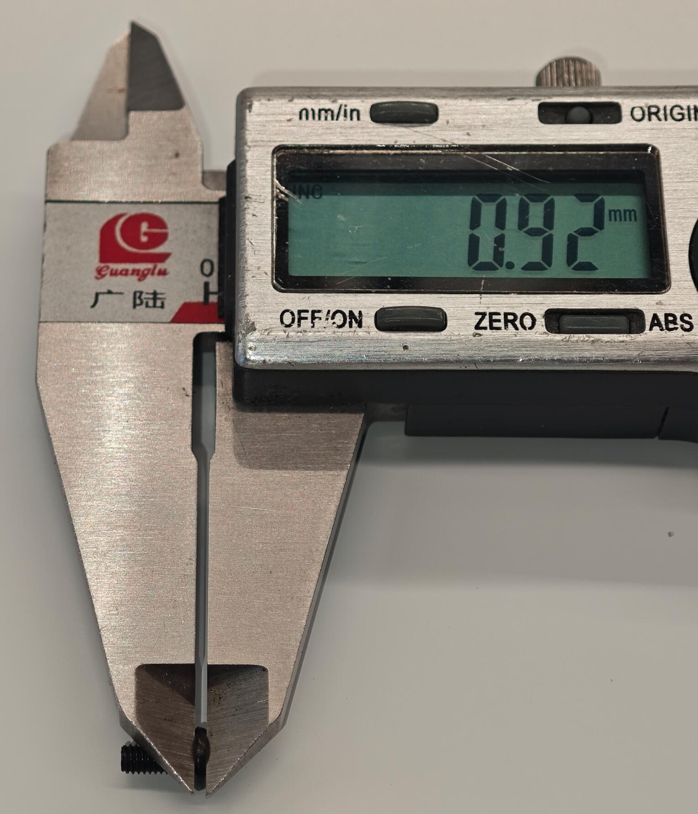

About screws:  M2.5*6 flat head screws, seen below:

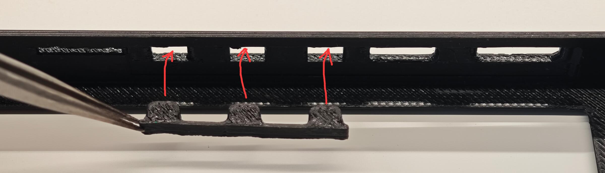

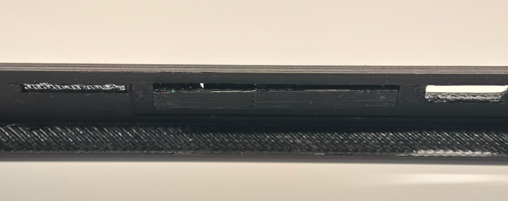

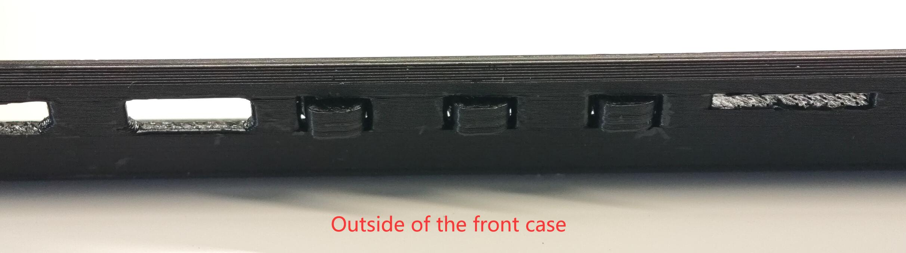

Step3: Install Glider 6 module into the front case, let the USB-C and HDMI connector insert the front case.

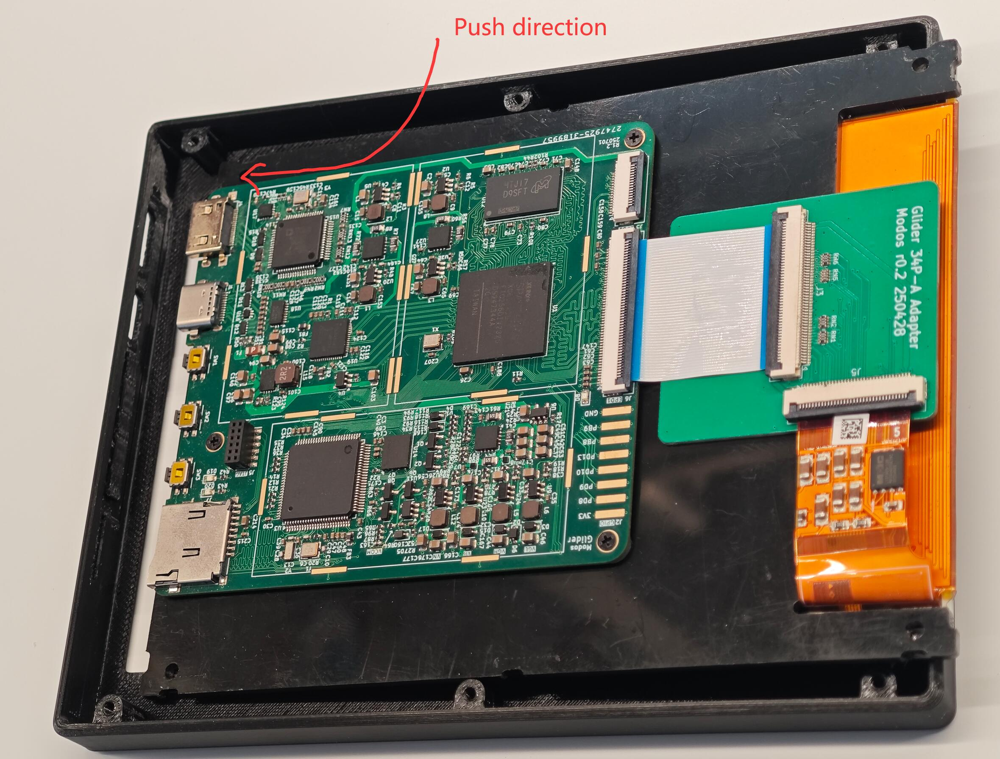

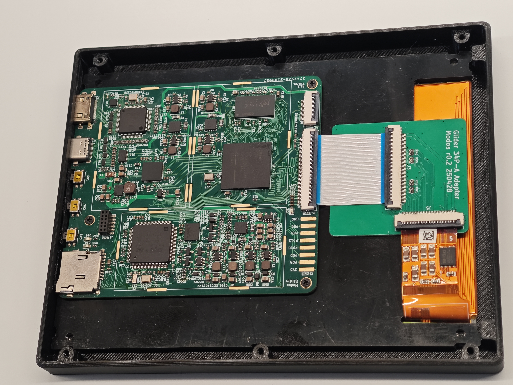

Step4: Install the back case

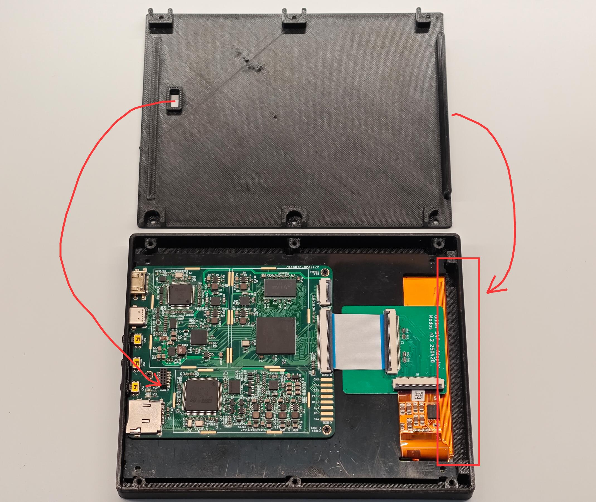

Step5: Install screws

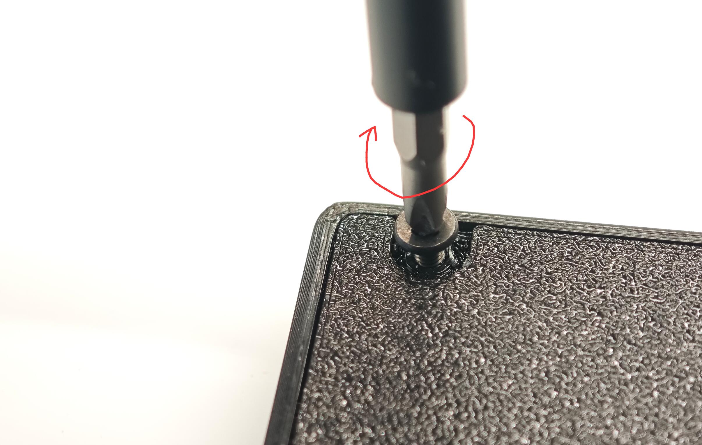

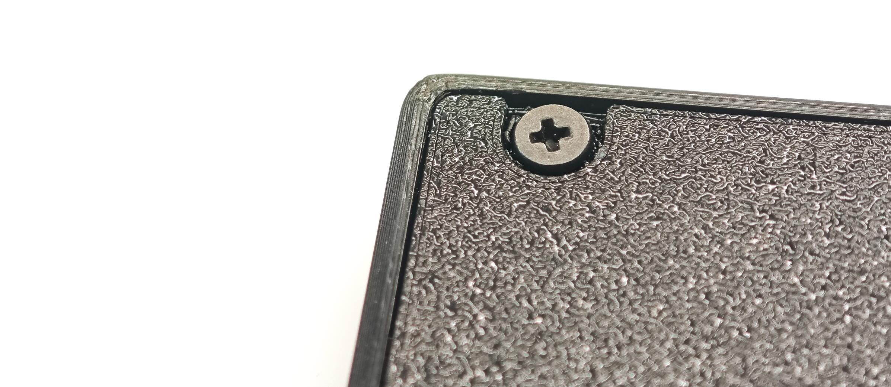

Step6: Check buttons and TF card slot, and finish the assembly.

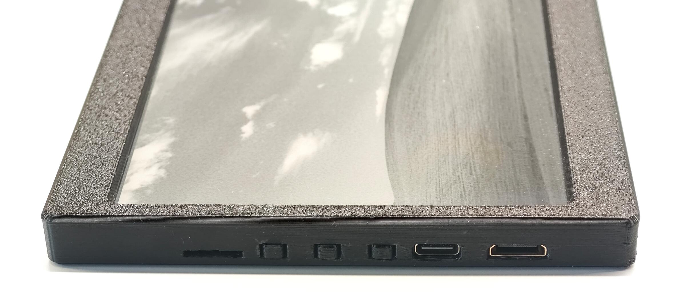

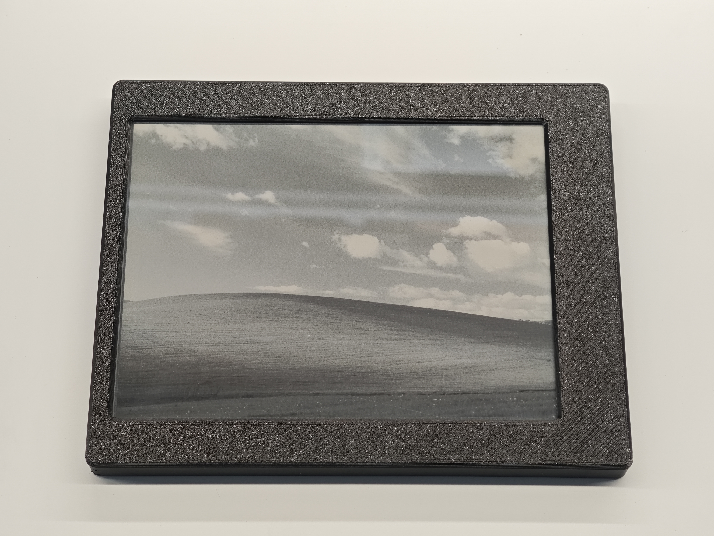
