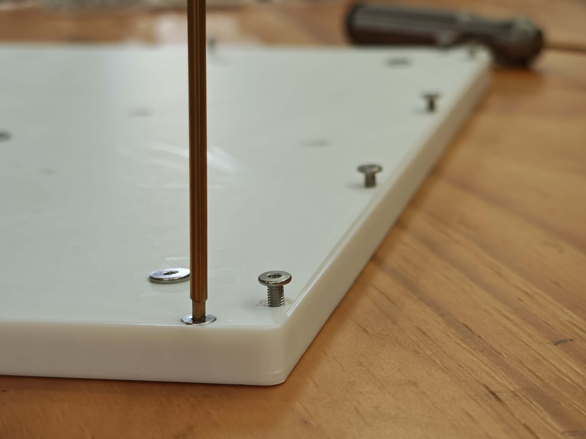
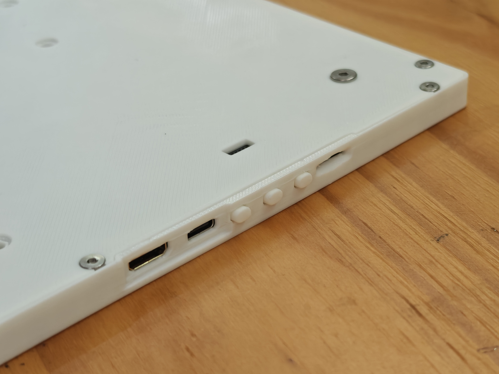
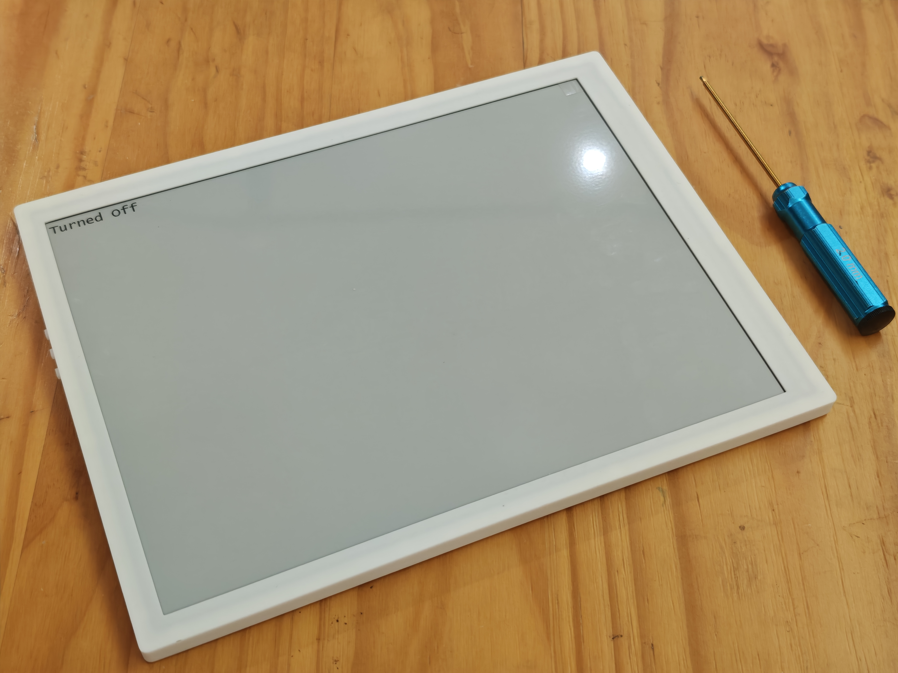

============================================================
GLIDER13 ASSEMBLY AND SAMPLE CASE FILES - README
============================================================

# FILE DESCRIPTIONS

* Assembly.step
  This file represents the Glider13 in its "out-of-the-box" 
  state as delivered.

* Assembly w Case.step
  A reference/sample case design for the Glider13.

* Case Components
  The case consists of three files: Frame1, Back Plate1, and 
  Button1. You can 3D print these parts directly and install 
  them onto the Glider13 Assembly.

# ASSEMBLY INSTRUCTIONS

1. MOUNTING THE ASSEMBLY:
   Use at least FIVE M4*5mm CM Flat-Head screws to secure the 
   Assembly to the Back Plate.

2. SECURING THE FRAME:
   Use 14 M3*6mm CM Flat-Head screws to fix the Back Plate 
   to the Frame.

3. PRINTING CALIBRATION:
   Due to the large physical size of the components, you may 
   need to adjust the SCALING/SHRINKAGE COMPENSATION in your 
   slicer settings to account for your 3D printer's specific 
   performance.

!!!!!!!!!!!!!!!!!!!!!!!!!!!!!!!!!!!!!!!!!!!!!!!!!!!!!!!!!!!!
[!] CRITICAL WARNING:
DO NOT use M4 screws longer than the specified length when 
securing the Assembly Plate. Using excessively long screws 
may pull out the HEAT-SET INSERTS or, in the worst case, 
CRACK THE SCREEN GLASS.
!!!!!!!!!!!!!!!!!!!!!!!!!!!!!!!!!!!!!!!!!!!!!!!!!!!!!!!!!!!!

# CHANGE LOG V1.1

- UPDATE: 
  Increased screw through-hole diameters for better clearance 
  and easier fitting.

- BUG FIX: 
  Corrected M4 CM countersunk hole diameter: 
  7.2mm -> 8.2mm.

- BUG FIX: 
  Fixed M3 screw length description error (CAD model was correct): 
  M3x8mm -> M3x6mm.
